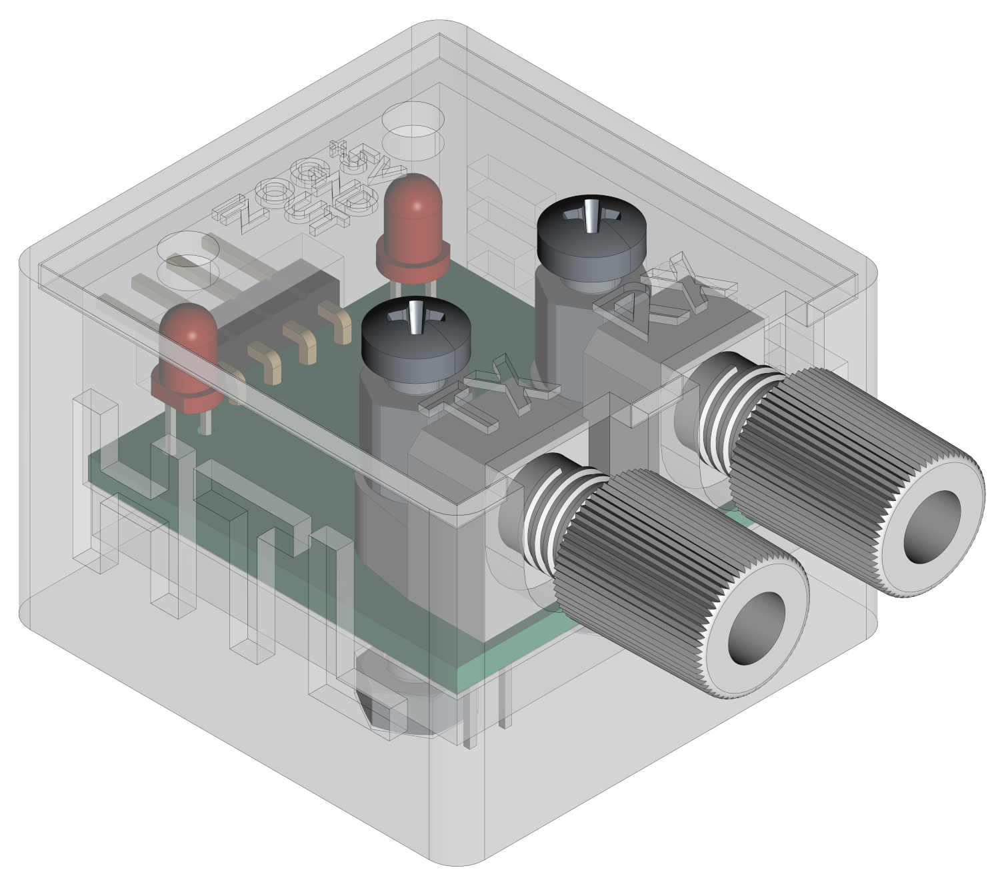
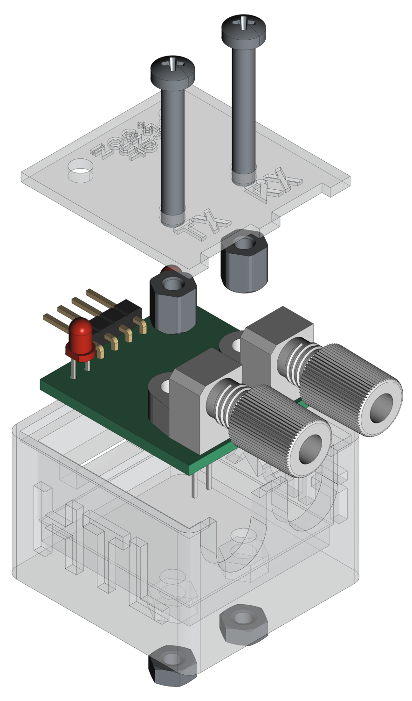

[](https://github.com/0x007e/oft) [](https://creativecommons.org/licenses/by-nc-sa/4.0/legalcode) 

# `OFT` - Optical Fibre Transceiver

The `OFT` project is based on a fibre optic transmitter an receiver ([FB104](#additional-information)). The transmitter is based on a high-output medium-speed infrared LED while the transceiver is built on a high-sensitivity NPN phototransistor. Both are housed in a connector-less style plastic fiber optic package. The transmitter has a typical peak wavelength of `930nm`. The bandwith of the receiver is between `400nm` to `1100nm`. The maximum photosensitivity is around `870nm`. The receiver and transmitter is connected with an `RX` and `TX` LED over a `NE555` timer circuit to indicate if a data transmission occurrs.

> Note that the `IF-D92` is suitable for digital data links at rates up to `20kbps`!

| Experience | Level |
|:------------|:-----:|
| Soldering   |  |
| Mechanical  |  |

# Downloads

| Type      | File               | Description              |
|:---------:|:------------------:|:-------------------------|
| Schematic | [pdf](https://github.com/0x007E/oft/releases/latest/download/schematic.pdf) / [cadlab](https://cadlab.io/project/29648/main/files) | Schematic files |
| Board | [pdf](https://github.com/0x007E/oft/releases/latest/download/pcb.pdf) / [cadlab](https://cadlab.io/project/29648/main/files) | Board file |
| Drill | [pdf](https://github.com/0x007E/oft/releases/latest/download/drill.pdf) | Drill file |
| PCB | [zip](https://github.com/0x007E/oft/releases/latest/download/kicad.zip) / [tar](https://github.com/0x007E/oft/releases/latest/download/kicad.tar.gz) | KiCAD/Gerber/BoM/Drill files |
| Mechanical | [zip](https://github.com/0x007E/oft/releases/latest/download/freecad.zip) / [tar](https://github.com/0x007E/oft/releases/latest/download/freecad.tar.gz) | FreeCAD/Housing and PCB (STEP) files     |

# Hardware

There are two parts of the hardware. The pcb and the housing of the `OFT`. The pcb is created with [KiCAD](#additional-information) and the housing with `FreeCAD`. All files are built with `github actions` so that they are ready for a production environment. The housing is printed with a 3D-printer (`Dremel 3D40`).

## PCB

The circuit board is populated on both sides (Top, Bottom). The best way for soldering the `SMD` components is within a vapor phase soldering system and for the `THT` components with a standard soldering system.

### Top Layer


### Bottom Layer


## Mechanical

The housing has a tolerance of `0.2mm` on each side of the case. So the pcb should fit perfectly in the housing. The tolerance can be modified with `FreeCAD` in the `Parameter` Spreadsheet.

### Assembled



#### Exploded



# Connection/Setup

The `OFT` is powerd with `5V`. The `RX` pin serves as an output and stores the received data at the output so that it can be read by the device. The `TX` pin servs as an input and sends the received data at the input over the fibre channel. The levels of both pins are `LOW = 0V` and `HIGH = 5V`.

``` bash
#
#                                      +----------------+      +---------------------+
#                                      |    U       +---+---+  |                     |
#                                      |    S       |  USB  |--+ +-----------------+ |
#                                      |    B       +---+---+  | | TeraTerm        | |
#              +-------------+         |    /           |      | | ~~~~~~~~        | |
#              |      O      |         |    U           |      | | ~~~~~           | |
#            +--+--+  F   +--+--+   +--+--+ A           |      | | ~~~~~~~~~~~~    | |
#      L +---+ ORX |  T   | VCC +---+ VCC | R           |      | |                 | |
#      O |   +--+--+      | GND +---+ GND | T  +-+      |      | +-----------------+ |
#      O |      |         +-----+   +-----+   / /       |      |                     |
#      P |   +--+--+      | RXD +---+ RXD | +-+-+-+-----+      | Computer            |
#      B +---+ ORX |      | TXD +---+ TXD | | 5V  | 3V3 |      |                     |
#      A     +--+--+      +--+--+   +--+--+ +-----+-----+      +---------------------+
#      C       |             |
#      K       +-------------+                                            
#
```

> The maximum baudrate should be about `~19200bps`!

# Additional Information

| Type       | Link                                                   | Description                            |
|:----------:|:------------------------------------------------------:|:---------------------------------------|
| IF-E10     | [pdf](https://i-fiberoptics.com/pdf/if-e10.pdf)        | Optical fibre receiver and transmitter |
| NE555      | [pdf](https://www.ti.com/lit/ds/symlink/se555.pdf)     | Universal timer and oscillator         |
| KiCAD      | [web](https://www.kicad.org/)                          | KiCAD project page                     |
| FreeCAD    | [web](https://www.freecad.org/)                        | FreeCAD project page                   |

---

R. GAECHTER
